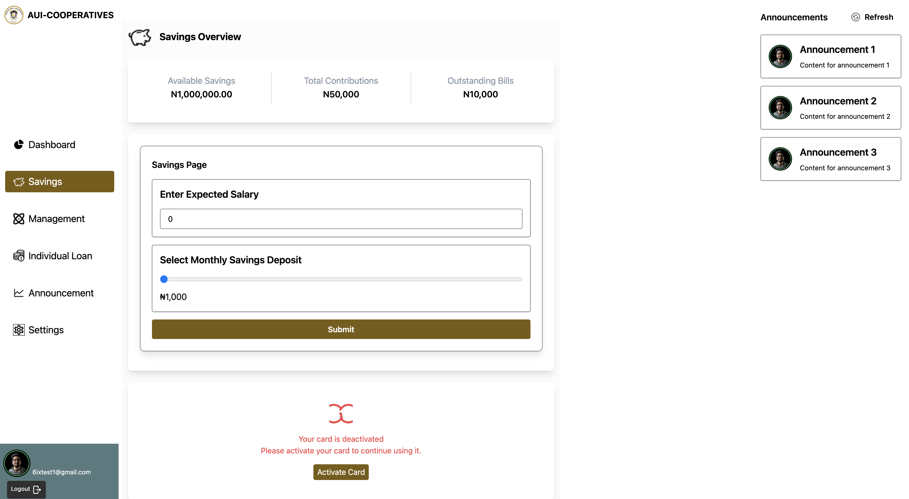

# AUI Cooperatives Platform

## Overview

The **AUI Cooperatives Platform** is a web-based system designed to manage and facilitate cooperative operations at **Augustine University**. This platform enables members to contribute savings, apply for loans, and stay updated with announcements, ensuring smooth financial management and transparency within the cooperative society.

## Features

- **Member Management**: Registration, authentication, and role-based access for cooperative members.
- **Savings Contributions**: Members can contribute savings directly through the platform.
- **Loan Management**: Loan application, approval process, and repayment tracking.
- **Announcement Board**: A centralized page where updates and important notices are shared.
- **Dashboard & Reports**: Insights into member activities, contributions, loans, and financial summaries.
- **University News & Member Role Display**: The dashboard displays the latest news from AUI along with each member's role and total savings.

## Tech Stack

- **Frontend**: TypeScript, React, Tailwind CSS
- **Backend**: Django (Python)
- **Database**: PostgreSQL

## Getting Started

### Prerequisites

Ensure you have the following installed on your system:

- **Node.js** (latest LTS version)
- **Python 3.9+**
- **PostgreSQL**
- **Django & Required Packages**
- **Git**

### Installation

#### 1. Clone the Repository

```sh
git clone https://github.com/your-username/aui-cooperative.git
cd aui-cooperative
```

#### 2. Set Up the Backend (Django)

```sh
cd backend
python3 -m venv venv
source venv/bin/activate  # On Windows, use `venv\Scripts\activate`
pip install -r requirements.txt
python manage.py migrate
python manage.py runserver
```

#### 3. Set Up the Frontend (React)

```sh
cd frontend
npm install
npm run dev
```

### Usage

1. Open the backend server at `http://127.0.0.1:8000/`
2. Open the frontend on `http://localhost:5173/` (or the port assigned by Vite).
3. Register/login as a cooperative member.
4. Explore features such as **savings**, **loan applications**, **announcements**, and **dashboard insights**.

## Screenshots




_The above are related pages view._

## Contribution

This project is under active development. Contributions are welcome! Feel free to fork the repository, create a branch, and submit a PR.

## Contact

For any inquiries or support, reach out to **ukcharlies@gmail.com**.
